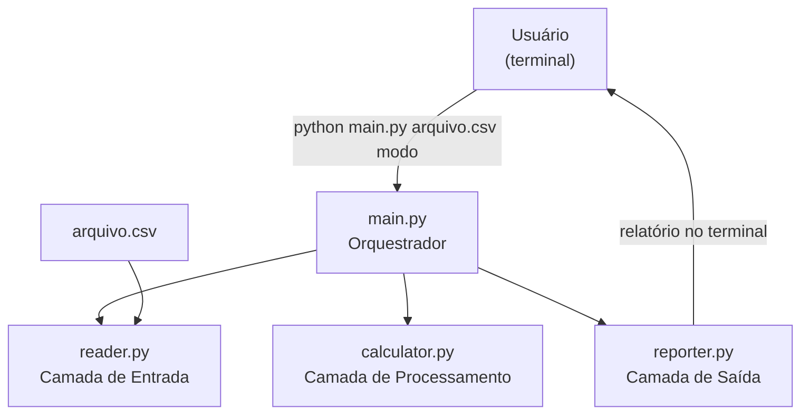
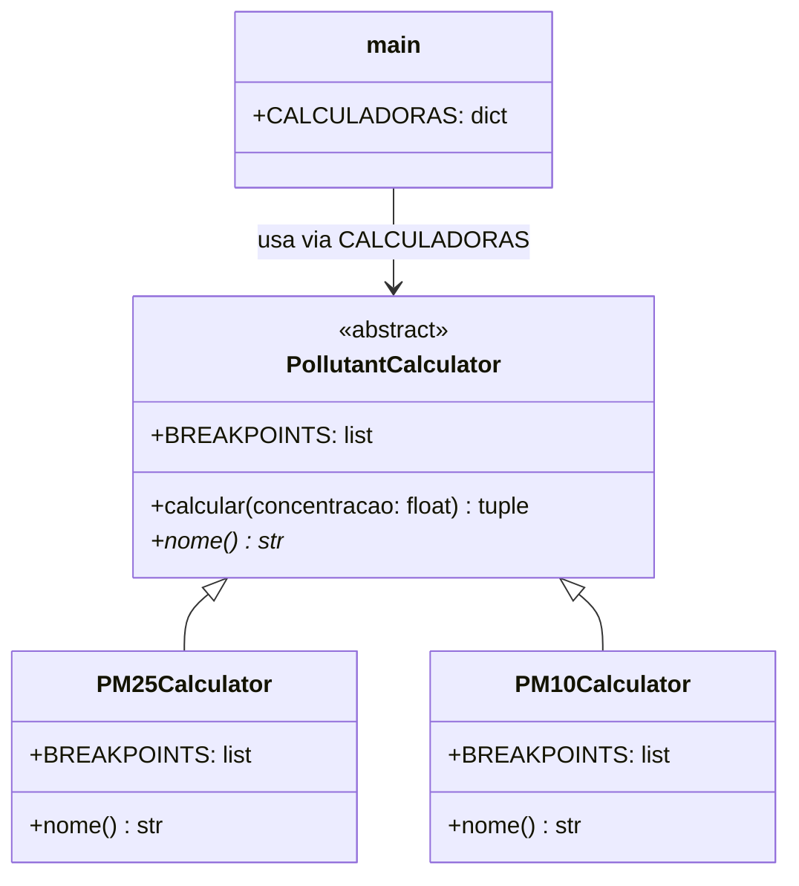
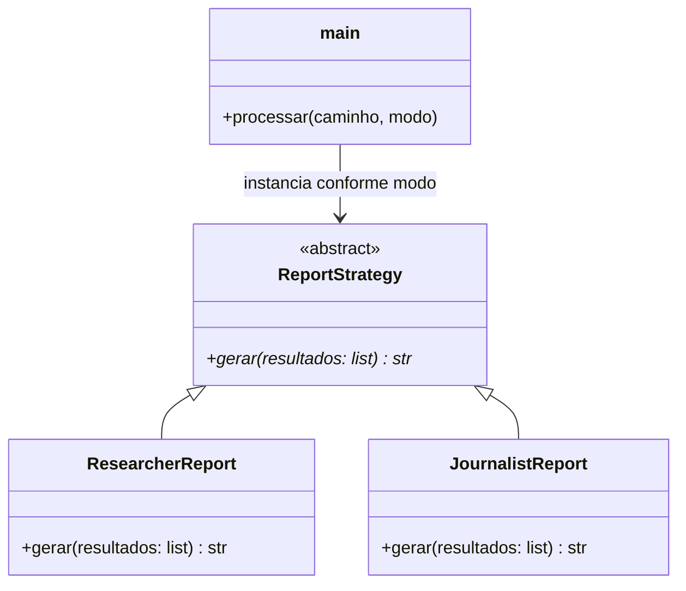

# Arquitetura — Sistema Analisador de Qualidade do Ar

**Sprint 2 · Projeto da Aplicação**

**Membros:**
- Arthur Francisco da Silva Palma — 2369060
- Luiz Fernando Rolim Vieira — 2419939

---

## 1. Padrões de Codificação e Gestão de Qualidade

### Estilo de código
- **PEP 8**: indentação com 4 espaços, linhas de até 100 caracteres, nomes em `snake_case` para variáveis e funções, `PascalCase` para classes.
- **Type hints**: todas as funções públicas anotadas com tipos (`-> str`, `list[Resultado]`, etc.).
- **Docstrings**: toda função pública documentada com descrição, `Args:` e `Returns:`.
- **Sem valores mágicos**: constantes nomeadas em maiúsculas (`FAIXAS_CRITICAS`, `SEPARADOR`, `COLUNAS_OBRIGATORIAS`).

### Gestão do repositório
- Commits realizados a cada aula de desenvolvimento e antes de cada review.
- Mensagens de commit descritivas em português (ex: `Adiciona PM10Calculator com breakpoints CONAMA 491`).
- Estrutura de pastas conforme especificação do professor:

```
codigo/
  main.py
  reader.py
  calculator.py
  reporter.py
  sample_data.csv
  tests/
    test_calculator.py
    test_reporter.py
docs/
  requisitos.md
  arquitetura.md
```

### Qualidade
- Nenhum `import *`; todos os imports são explícitos.
- Tratamento de erro em todas as entradas externas (CSV, argumentos de linha de comando).
- Avisos ao usuário para linhas inválidas sem interromper o processamento.

---

## 2. Diagrama de Arquitetura

O sistema segue uma **arquitetura em camadas (Layered Architecture)** com três camadas de responsabilidade única, orquestradas pelo `main.py`.



### Responsabilidades por componente

| Componente | Responsabilidade |
|---|---|
| `main.py` | Orquestra o pipeline; recebe argumentos da linha de comando; instancia o Strategy correto de relatório. |
| `reader.py` | Lê e valida o CSV; descarta linhas inválidas com aviso; retorna lista de `Medicao`. |
| `calculator.py` | Aplica as fórmulas e breakpoints da CONAMA 491/2018 por poluente; retorna IQAr e faixa. |
| `reporter.py` | Formata e exibe os resultados conforme o público-alvo (pesquisador ou jornalista). |

### Trade-offs justificados

**Layered Architecture foi escolhida porque:**
- Cada camada tem uma única razão para mudar (SRP): se o formato do CSV mudar, só `reader.py` é alterado; se uma fórmula mudar, só `calculator.py`.
- Facilita os testes automatizados: cada camada pode ser testada isoladamente com dados fictícios.
- Adequada ao escopo do projeto: pipeline linear sem necessidade de flexibilidade entre camadas em tempo de execução.

**Custo aceito:**
- Pouco flexível para mudanças de formato de entrada que afetem a interface entre camadas (ex: trocar CSV por API REST exigiria refatorar `reader.py` e ajustar `main.py`).

---

## 3. Padrões de Projeto

### Padrão 1 — Strategy em `calculator.py`

**Problema resolvido:** cada poluente tem breakpoints e unidades distintas, mas o fluxo de cálculo (interpolação linear + classificação) é idêntico. Sem o padrão, o código seria um bloco `if/elif` por poluente impossível de estender sem modificar código existente.

**Solução:** `PollutantCalculator` define a interface e a fórmula compartilhada. Cada subclasse declara apenas seus breakpoints e nome.



**Como adicionar um novo poluente (ex: O₃):** criar `O3Calculator(PollutantCalculator)` com seus breakpoints e registrá-lo em `CALCULADORAS`. Nenhuma outra classe é modificada — Open/Closed Principle.

---

### Padrão 2 — Strategy em `reporter.py`

**Problema resolvido:** HU-01 (pesquisador) e HU-02 (jornalista) compartilham a mesma entrada de dados, mas exigem formatos de saída completamente diferentes. Embutir os dois formatos em uma única função com `if modo == "pesquisador"` mistura responsabilidades e dificulta a adição de novos formatos.

**Solução:** `ReportStrategy` define a interface `gerar(resultados)`. `ResearcherReport` e `JournalistReport` implementam formatos independentes. `main.py` instancia o Strategy correto com base no argumento do usuário.



**Como adicionar um novo formato (ex: CSV de saída):** criar `CSVReport(ReportStrategy)` e registrá-lo em `main.py`. Nenhum relatório existente é modificado.

---

## 4. Demonstração Funcional

Executar a partir da pasta `codigo/`:

```bash
# Relatório técnico (HU-01 — pesquisador)
python main.py sample_data.csv pesquisador

# Episódios críticos (HU-02 — jornalista)
python main.py sample_data.csv jornalista
```

**Saída esperada — modo pesquisador:**
```
[AVISO] Linha 10 ignorada: dados inválidos.
==============================================================
  RELATÓRIO TÉCNICO — IQAr (CONAMA 491/2018)
==============================================================
  2024-03-10 | Centro       | PM2.5  | Conc.:   18.50 µg/m³  | IQAr:   29.6 | Boa
  2024-03-10 | Centro       | PM10   | Conc.:   45.00 µg/m³  | IQAr:   36.0 | Boa
  2024-03-11 | Centro       | PM2.5  | Conc.:   55.20 µg/m³  | IQAr:   88.3 | Ruim
  ...
  Índice Geral: 234.3 (Péssima) — Poluente crítico: PM10
==============================================================
```

**Saída esperada — modo jornalista:**
```
==============================================================
  EPISÓDIOS CRÍTICOS DE QUALIDADE DO AR
==============================================================
  Qualidade do ar Ruim em 2024-03-11 na estação Centro (poluente monitorado: PM2.5).
  Qualidade do ar Muito Ruim em 2024-03-12 na estação Norte (poluente monitorado: PM2.5).
  Qualidade do ar Péssima em 2024-03-14 na estação Sul (poluente monitorado: PM10).
==============================================================
```
