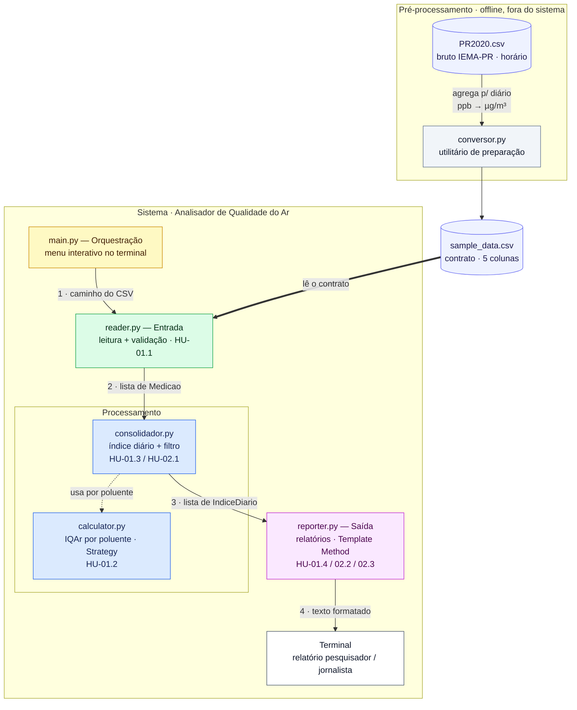
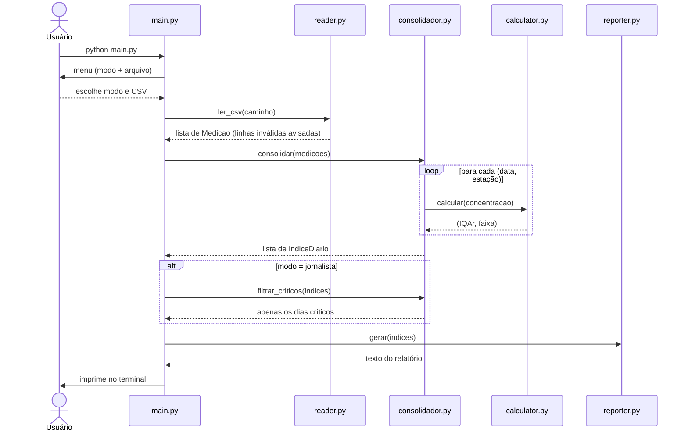
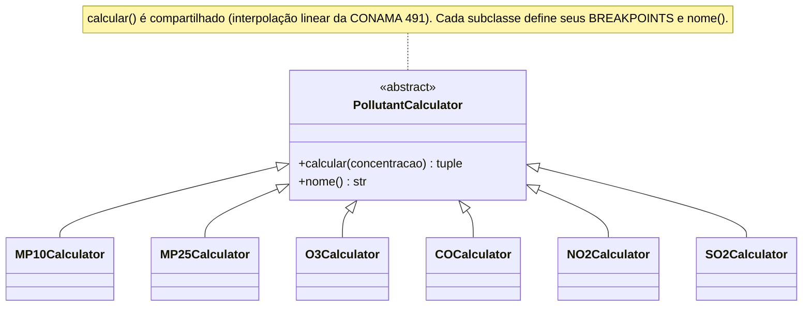
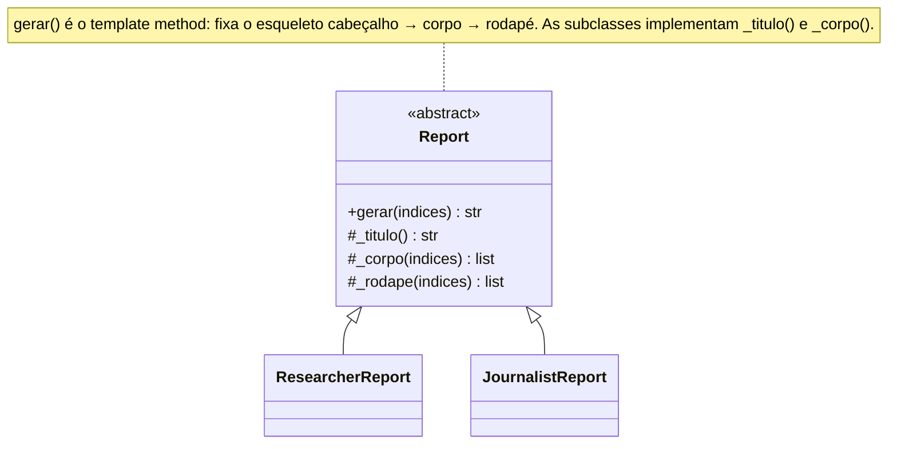

# Arquitetura — Analisador de Qualidade do Ar

> Sistema em Python que lê medições de poluentes de um arquivo CSV, calcula o **Índice de Qualidade do Ar (IQAr)** segundo a **Resolução CONAMA 491/2018** e gera relatórios no terminal para dois públicos: **pesquisadores** e **jornalistas**.

---

## 1. Visão geral

A aplicação é organizada em **camadas de responsabilidade única**, conectadas por um **orquestrador** (`main.py`). O dado entra por um **contrato fixo** (CSV de cinco colunas), é validado, processado em duas etapas — cálculo do IQAr por poluente e consolidação do índice diário por estação — e por fim formatado na saída.

Dois padrões de projeto estruturam os pontos onde o sistema varia. Na camada de processamento, o **Strategy** (`calculator.py`) trata cada poluente como uma estratégia de cálculo com seus próprios limites de faixa (*breakpoints*), enquanto a fórmula de interpolação permanece única e compartilhada. Na camada de saída, o **Template Method** (`reporter.py`) fixa o esqueleto do relatório e deixa que cada público implemente apenas os passos que mudam.

A preparação dos dados reais fica a cargo de um **utilitário separado** (`conversor.py`), que **não faz parte do sistema**: ele apenas transforma o dado bruto da fonte no contrato que o sistema consome, e roda uma única vez, fora do fluxo de execução.

---

## 2. Diagrama de arquitetura

As cores indicam a responsabilidade de cada peça: dados e contrato em índigo, utilitário offline em cinza, orquestração em âmbar, entrada em verde, processamento em azul e saída em magenta. A numeração de **1 a 4** mostra a ordem do fluxo em tempo de execução. A seta tracejada de `consolidador` para `calculator` representa uma **dependência de uso** (Strategy), e não um passo do pipeline.

---

## 3. Fluxo de execução

A leitura **descarta as linhas inválidas com aviso individual** (HU-01.1) em vez de abortar o processamento. O cálculo do IQAr acontece **dentro da consolidação**, uma vez por poluente de cada grupo (data, estação). E o **filtro de dias críticos** (HU-02.1) só é aplicado no modo jornalista — o pesquisador recebe todos os índices.

---

## 4. Camadas e responsabilidades

A **orquestração** (`main.py`) apresenta o menu, decide o modo e coordena a passagem de dados entre as camadas. A **entrada** (`reader.py`) lê o CSV e garante o contrato, devolvendo apenas medições válidas. O **processamento** divide-se em dois módulos: `calculator.py` calcula o IQAr de um poluente isolado, e `consolidador.py` agrupa as medições por dia/estação, define o pior índice de cada grupo e expõe o filtro de dias críticos. A **saída** (`reporter.py`) formata o resultado para o público escolhido.

### Mapeamento HU → módulo

| HU | Módulo responsável | Responsabilidade |
|----|--------------------|------------------|
| HU-01.1 | `reader.py` | leitura e validação do CSV (extensão, colunas, data, concentração) |
| HU-01.2 | `calculator.py` | cálculo do IQAr por poluente (Strategy) |
| HU-01.3 | `consolidador.py` | índice diário consolidado por estação (pior IQAr + poluente crítico) |
| HU-01.4 | `reporter.py` · `ResearcherReport` | relatório técnico para o pesquisador |
| HU-02.1 | `consolidador.py` · `filtrar_criticos` | filtro dos dias críticos a partir do índice diário |
| HU-02.2 | `reporter.py` · `JournalistReport` | relatório em linguagem leiga (máscara) |
| HU-02.3 | `reporter.py` · `JournalistReport` | ordem cronológica e mensagem de período sem críticos |

---

## 5. Padrões de projeto

### 5.1 Strategy — `calculator.py`

O cálculo do IQAr difere entre os poluentes **apenas nos limites de concentração de cada faixa** (e na unidade de medida); a fórmula de interpolação linear é idêntica para todos. O Strategy isola exatamente essa variação: a classe-base `PollutantCalculator` concentra a fórmula em `calcular()`, e cada subclasse declara somente os seus `BREAKPOINTS` e o seu `nome()`. As estratégias ficam registradas no dicionário `CALCULADORAS`, cuja chave é o código do poluente no contrato. Adicionar um novo poluente passa a ser **criar uma classe e registrá-la**, sem alterar o que já funciona — o princípio aberto/fechado na prática.

### 5.2 Template Method — `reporter.py`

Os dois relatórios seguem o **mesmo esqueleto** — cabeçalho, corpo e rodapé, unidos por quebras de linha —, mudando apenas o conteúdo de cada passo. `Report.gerar()` fixa essa ordem (o *template method*, que não deve ser sobrescrito) e delega os passos variáveis `_titulo()` e `_corpo()` às subclasses, oferecendo `_rodape()` como *hook* opcional. `ResearcherReport` produz o detalhamento técnico por dia/estação; `JournalistReport` produz as frases em linguagem leiga. O padrão garante relatórios **consistentes em forma** e torna trivial acrescentar um terceiro público no futuro.

---

## 6. Contrato de dados e o conversor

O sistema lê **somente** o contrato abaixo — a origem do dado é irrelevante para ele:

| coluna | tipo | exemplo |
|--------|------|---------|
| `data` | texto no formato `YYYY-MM-DD` | `2020-01-18` |
| `estacao` | texto | `CSN` |
| `poluente` | texto (`MP10`, `MP2,5`, `O3`, `CO`, `NO2`, `SO2`) | `SO2` |
| `concentracao` | decimal não negativo | `80.86` |
| `unidade` | texto | `µg/m³` |

O `conversor.py` é um **utilitário de preparação**: ele pega o dado bruto da rede de monitoramento IEMA-PR (medições **horárias**, com os gases em **ppb**) e produz o `sample_data.csv` já no contrato — médias **diárias**, gases convertidos para **µg/m³** e o CO em **ppm**. Ele roda **uma única vez, fora do fluxo**, e o sistema nunca depende dele em tempo de execução. Essa separação mantém o sistema **desacoplado da fonte**: trocar de fonte de dados significa trocar (ou criar outro) conversor, sem tocar em nenhuma das camadas do sistema.

---

## 7. Decisões de arquitetura

**Sem interface gráfica.** A interação é feita por um **menu no terminal** (`main.py`), conforme o enunciado. Como conveniência, o `main` também aceita argumentos opcionais (`python main.py <arquivo.csv> <modo>`) para execução rápida, sem alterar o fluxo principal.

**Consolidação como etapa explícita.** O índice diário por estação (HU-01.3) é uma etapa de processamento própria (`consolidador.py`), separada do cálculo por poluente (`calculator.py`). Isso mantém cada responsabilidade testável de forma isolada e faz a consolidação alimentar tanto o relatório técnico quanto o filtro de dias críticos.

**Dois padrões distintos, em camadas distintas.** Strategy e Template Method atuam em pontos de variação diferentes — o *como calcular* na camada de processamento e o *como apresentar* na camada de saída —, evitando forçar um único padrão onde ele não se encaixa.

**Norma CONAMA 491/2018.** Os *breakpoints* do IQAr seguem a tabela da CETESB referente à Resolução 491/2018. Não se utiliza a CONAMA 506/2024 por ser posterior ao período dos dados analisados (ano de 2020), quando a 491 estava em vigor.
