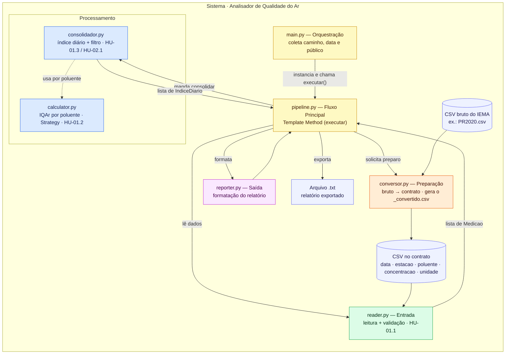
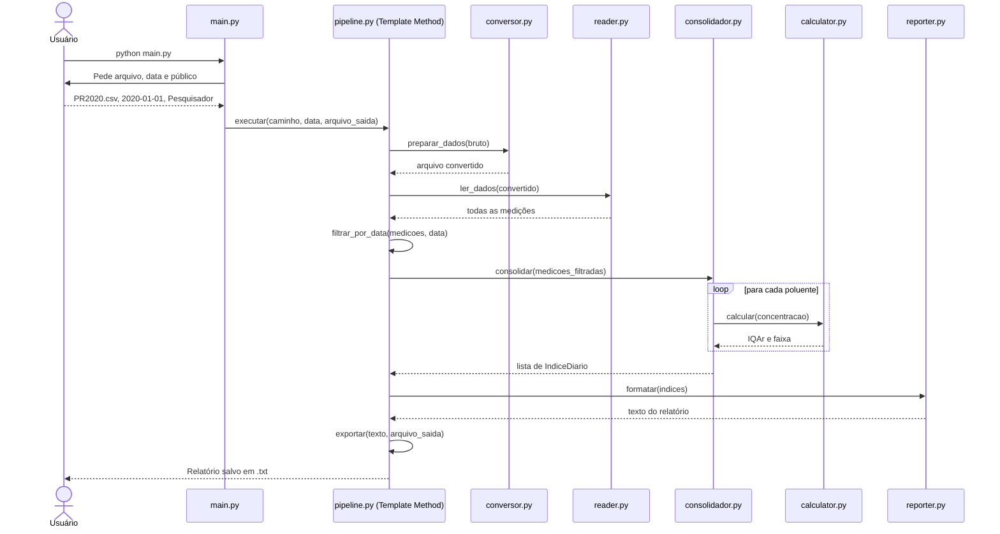
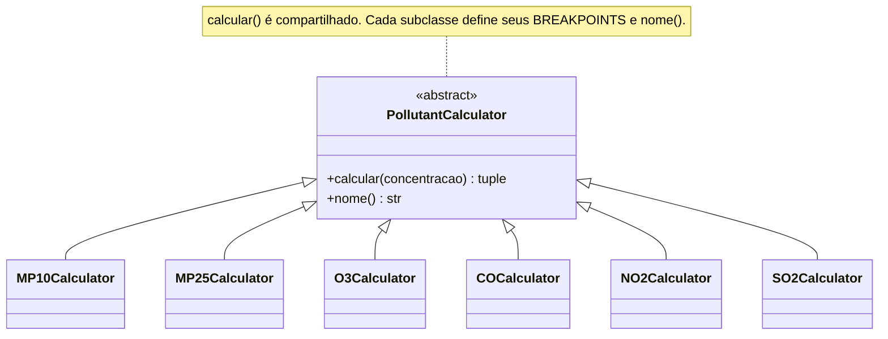
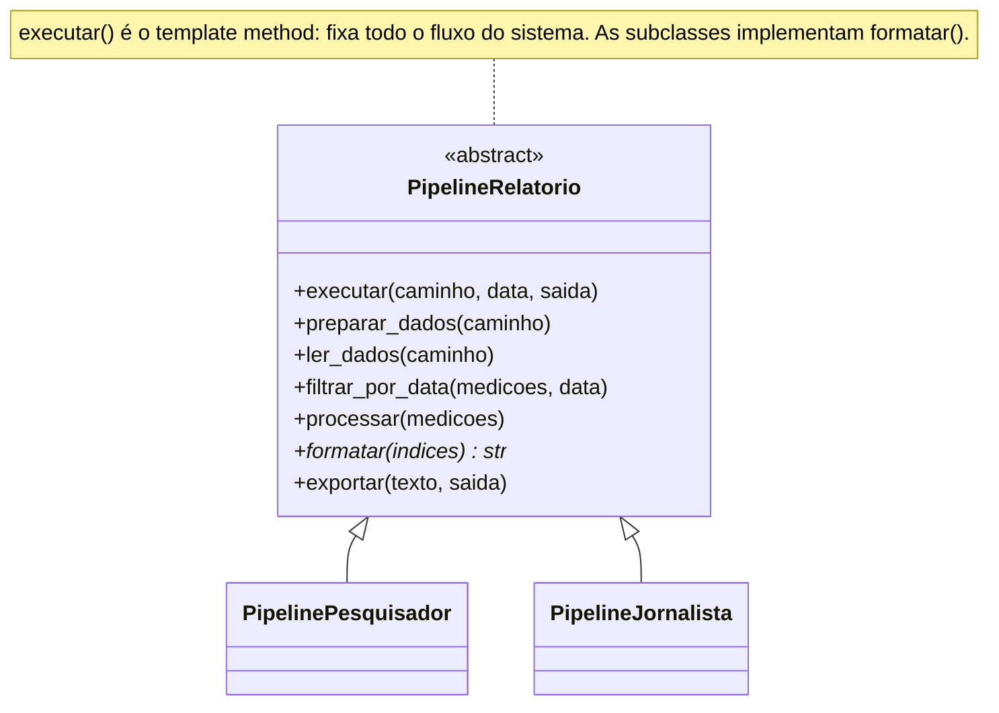

# Arquitetura — Analisador de Qualidade do Ar

> Sistema em Python que lê medições de poluentes de um arquivo CSV, calcula o **Índice de Qualidade do Ar (IQAr)** segundo a **Resolução CONAMA 491/2018** e gera relatórios exportados em `.txt` para dois públicos: **pesquisadores** e **jornalistas**.

---

## 1. Visão geral

A aplicação é organizada em **camadas de responsabilidade única**, conectadas por um **orquestrador** (`main.py`) que conduz a interação inicial e aciona um **Pipeline de Relatório**.

O uso flui de maneira simples e linear: o usuário informa o caminho do **arquivo bruto**, escolhe uma **data**, seleciona o **público** (pesquisador ou jornalista) e o sistema cuida do resto, exportando o relatório em `.txt`. O sistema executa automaticamente a etapa de **preparação** (conversão para o contrato de entrada), o **filtro** por data, a consolidação e a exportação para o arquivo final.

Internamente, o dado sempre chega à análise no mesmo **contrato fixo** (CSV de cinco colunas), é validado, processado em duas etapas (cálculo do IQAr por poluente e consolidação do índice diário por estação) e formatado na saída.

Dois padrões de projeto estruturam os pontos onde o sistema varia. Na camada de processamento, o **Strategy** (`calculator.py`) trata cada poluente como uma estratégia de cálculo com seus próprios limites de faixa (*breakpoints*), mantendo única a fórmula de interpolação. Na camada de orquestração, o **Template Method** (`pipeline.py`) fixa todo o esqueleto do fluxo do sistema (converter, ler, filtrar, processar, exportar) e deixa as subclasses implementarem o formato de texto que muda conforme o público.

---

## 2. Diagrama de arquitetura

---

## 3. Fluxo de execução

A leitura **descarta as linhas inválidas com aviso individual** (HU-01.1) sem abortar o processamento. O cálculo do IQAr acontece **dentro da consolidação**, uma vez por poluente. O fluxo agora é guiado pela classe base `PipelineRelatorio`.

---

## 4. Camadas e responsabilidades

A **orquestração** (`main.py`) obtém os inputs iniciais do usuário e repassa para o `pipeline.py`. O pipeline executa a **preparação** (`conversor.py`) para gerar o arquivo no contrato. A **entrada** (`reader.py`) lê o contrato e devolve as medições. O **processamento** divide-se em dois módulos: `calculator.py` calcula o IQAr e `consolidador.py` agrupa as medições. A **saída** (`reporter.py`) compõe o texto, que é devolvido ao pipeline para ser **exportado**.

### Mapeamento HU → módulo

| HU | Módulo responsável | Responsabilidade |
|----|--------------------|------------------|
| HU-01.1 | `reader.py` | leitura e validação do CSV (extensão, colunas, data, concentração) |
| HU-01.2 | `calculator.py` | cálculo do IQAr por poluente (Strategy) |
| HU-01.3 | `consolidador.py` | índice diário consolidado por estação (pior IQAr + poluente crítico) |
| HU-01.4 | `pipeline.py` / `reporter.py` | relatório técnico para o pesquisador |
| HU-02.1 | `consolidador.py` / `pipeline.py` | filtro dos dias críticos a partir do índice diário |
| HU-02.2 | `reporter.py` | relatório em linguagem leiga (máscara) |
| HU-02.3 | `reporter.py` | ordem cronológica e mensagem de período sem críticos |

---

## 5. Padrões de projeto

### 5.1 Strategy — `calculator.py`

O cálculo do IQAr difere entre os poluentes **apenas nos limites de concentração de cada faixa**; a fórmula de interpolação linear é idêntica para todos. A classe-base `PollutantCalculator` concentra a fórmula em `calcular()`, e cada subclasse declara somente os seus `BREAKPOINTS`. 

### 5.2 Template Method — `pipeline.py`

O fluxo geral de todas as execuções do sistema segue os mesmos passos fixos (preparar, ler, filtrar, processar, formatar, exportar). `PipelineRelatorio.executar()` fixa essa ordem (o *template method*) e delega a criação do texto do relatório (`formatar()`) para as subclasses concretas. `PipelinePesquisador` extrai um relatório completo, enquanto `PipelineJornalista` aplica o filtro de episódios críticos antes de montar a formatação jornalística.

---

## 6. Contrato de dados e a preparação

A análise lê **somente** o contrato abaixo — de onde o dado veio não importa para ela:

| coluna | tipo | exemplo |
|--------|------|---------|
| `data` | texto no formato `YYYY-MM-DD` | `2020-01-18` |
| `estacao` | texto | `CSN` |
| `poluente` | texto (`MP10`, `MP2,5`, `O3`, `CO`, `NO2`, `SO2`) | `SO2` |
| `concentracao` | decimal não negativo | `80.86` |
| `unidade` | texto | `µg/m³` |

A etapa de preparação (`conversor.py`) é quem cuida da origem do dado. Ela recebe o CSV bruto e produz um arquivo no contrato.

---

## 7. Decisões de arquitetura

**Portabilidade e arquivos junto do código.** Os caminhos são resolvidos em relação à pasta do próprio script (Path(__file__)), mantendo o projeto portável e permitindo a exportação do `.txt` diretamente na pasta do usuário sem complicação.

**Template Method Extensivo.** Optou-se por subir o nível do *Template Method* da camada de saída isolada (`reporter.py`) para englobar toda a execução (`pipeline.py`). Isso tornou a arquitetura do projeto mais robusta e evidenciou claramente a estrutura de passos imutáveis exigida pelo padrão.

**Norma CONAMA 491/2018.** Os *breakpoints* do IQAr seguem a tabela da CETESB referente à Resolução 491/2018. Não se utiliza a CONAMA 506/2024 por ser posterior ao período dos dados analisados (ano de 2020), quando a 491 estava em vigor.
